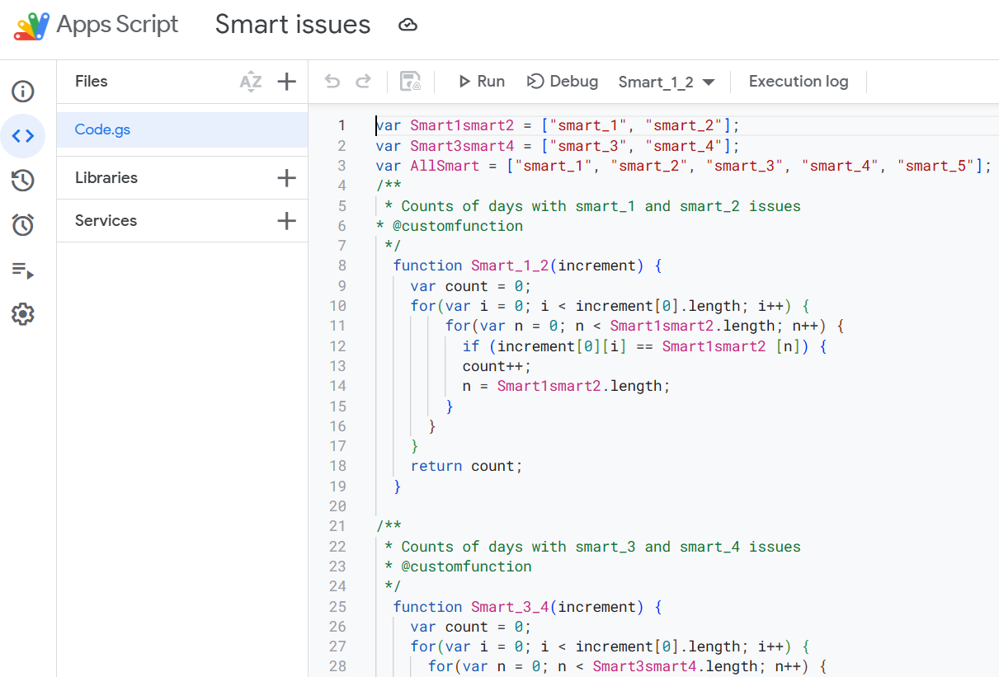
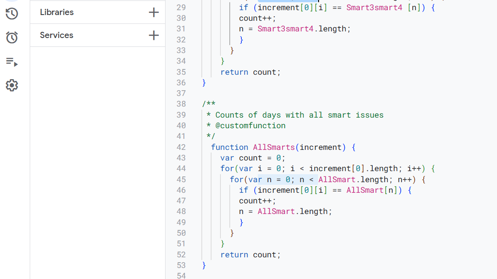

# Hard Drive SMART Issues Monitoring (Demo Project)
This project is a **demo automation model** built with **Google Apps Script + Google Sheets**.
It is based on the Hard Drive Failure Prediction ST4000DM000 (Q4 2018) dataset from Kaggle, but was **simplified** for demonstration purposes:
- Original numeric SMART values were replaced with classified categories (smart_1–smart_5) to focus on automation logic instead of failure prediction.
- Some dates and values were adjusted to create a clean test dataset.

👉 [View the demo Google Sheet](https://docs.google.com/spreadsheets/d/1DvECdW9crOfHB8jGWuctPl4eiJI6MNvxhHE1FOmlii0/edit?usp=sharing) 

## Features

✅ Custom Google Apps Script functions for automated issue counts:  
- **Smart_1_2()** → Count of days with SMART_1 & SMART_2 issues (last 3 months)  
- **Smart_3_4()** → Count of days with SMART_3 & SMART_4 issues (last 3 months)  
- **AllSmarts()** → Total count of days with all SMART issues (last 3 months)  

✅ Derived metrics in Google Sheets:  
- **% of days with issues** → formula `=(F2/90)*100` (formula preserved in row 2 for reusability)  
- **Performance level** → formula `=IF(G2<31,"High",IF(G2<71,"Medium","Low"))` (also saved in row 2)  

✅ Conditional formatting for performance levels:  
- High = green  
- Medium = yellow  
- Low = red  

✅ Tabular structure:  
- `serial_number`  
- `model`  
- `capacity_bytes`  
- Aggregated issue counts (last 3 months)  
- Derived metrics (% of days with issues, performance level)  
- Columns with event dates of technical issues  

## Purpose

The project replicates workflows from a **Data Quality / Operations Analyst** role:  
- Automating repetitive data aggregation  
- Translating raw technical logs into monitoring metrics  
- Presenting results in an intuitive format (tables + conditional formatting)  

This is not intended as a predictive failure model but as a **demonstration of automation and reporting skills**.  

## Tech stack
- **Google Sheets**  
- **Google Apps Script**  
- **Kaggle dataset (Q4 2018, simplified)**

### Google Apps Script view  
Shows custom functions created in the Google Apps Script editor to automate calculations and simulate real workflow logic within the spreadsheet.  

  

